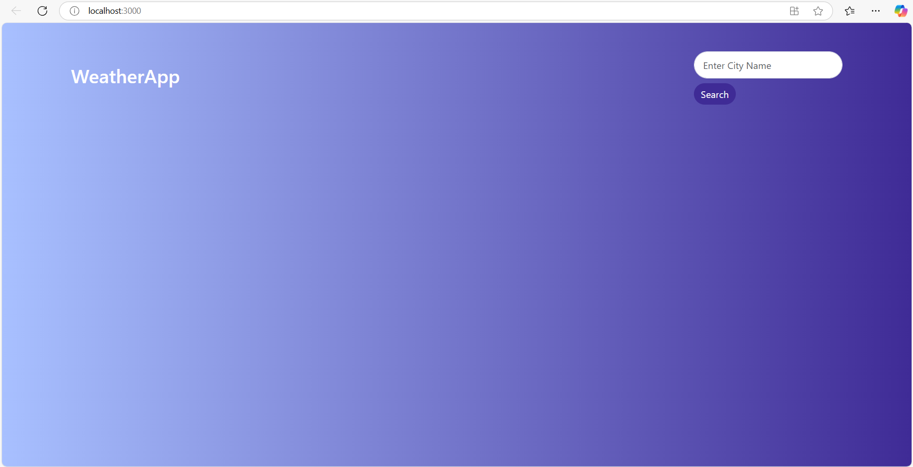
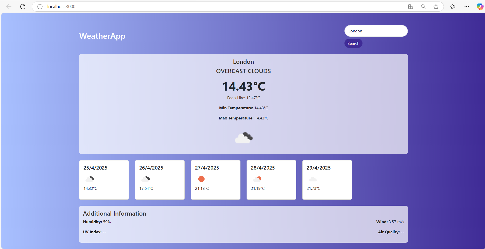

# 🌦 WeatherApp

A full-stack weather forecast app built using **React** and **Node.js**. The app displays current weather conditions and a 5-day forecast using the OpenWeatherMap API. The backend securely stores the API key and handles all external requests, keeping your frontend clean and safe.

---

## 🚀 Features

- 🔍 Search for any city’s weather
- 🌤 View current temperature, min/max, feels-like temp
- 📅 Get a 5-day forecast (with icons and daily temps)
- 💨 View humidity and wind speed
- 🔒 API key is securely hidden in the backend
- 📱 Fully responsive design using Bootstrap

---

## 🧑‍💻 Tech Stack

**Frontend:**

- React
- Bootstrap 5
- CSS

**Backend:**

- Node.js (no Express)
- Axios
- dotenv

**API:**

- [OpenWeatherMap API](https://openweathermap.org/api)

---

## ⚙️ Getting Started

### 1. Clone the repository

```bash
git clone https://github.com/Prem386/weather-app.git
cd weather-app
```

---

### 2. Backend Setup

```bash
cd server
npm install
```

Create a `.env` file inside the `server` folder:

```env
WEATHER_API_KEY=your_openweather_api_key_here
```

Start the backend:

```bash
node index.js
```

---

### 3. Frontend Setup

Open a new terminal window:

```bash
cd client
npm install
npm start
```

---

## 📁 Folder Structure

```
weather-app/
├── client/         # React frontend
│   └── src/
│       ├── WeatherApp.js
│       ├── style.css
│       └── index.js
│
├── server/         # Node backend
│   ├── index.js
│   └── .env
│
├── screenshot1.png
├── screenshot2.png
└── README.md
```

---

## 📸 Screenshots

### 🌤 Main Weather View


### 📅 5-Day Forecast Section


## 🛠 Future Improvements

- 🌐 Auto-detect user location using geolocation API
- 🎨 Weather-based dynamic backgrounds
- 🌙 Dark mode support
- 📈 Hourly forecast view
- 💾 Save search history

---

## 🤝 License

MIT License  
© 2025 Prem ([@Prem386](https://github.com/Prem386))
